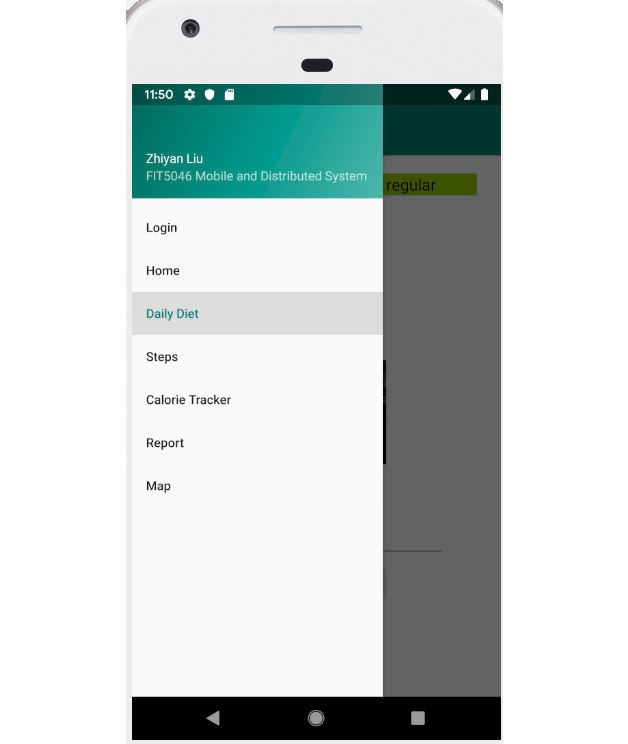
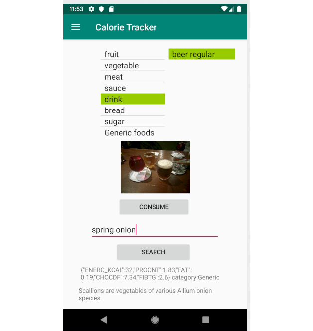
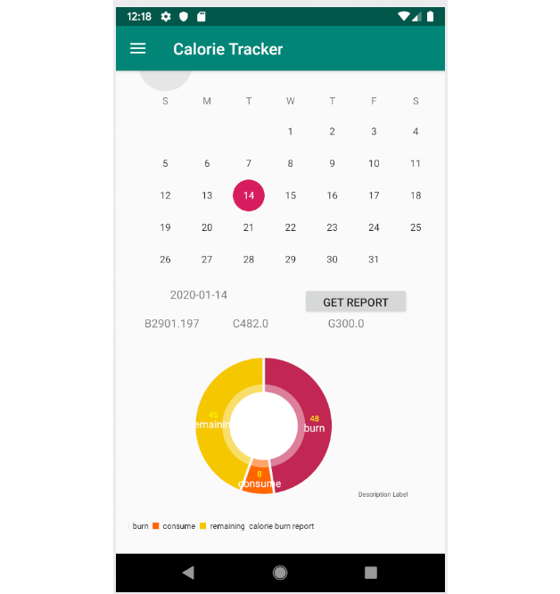
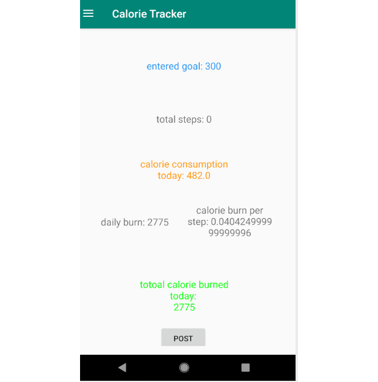
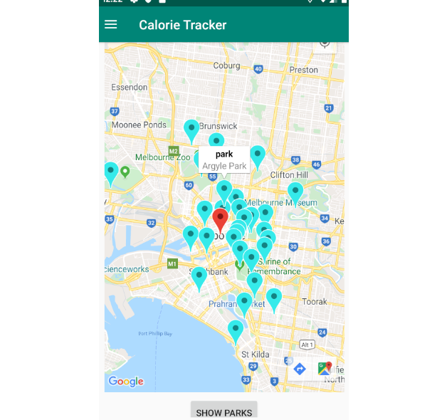
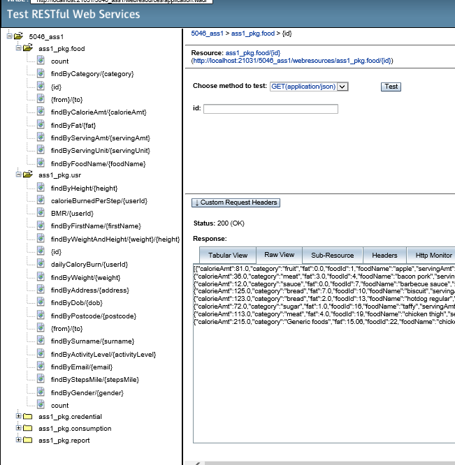

# FIT5046_Android_Assignments
 the Calories Tracker app
  
1. overview of the navigation drawer 

2. google image search beased on food names in database

3. simple data visualization, presenting data from database by pie chart and bar chart

4. post local records to the database

5. presenting the current location and nearby parks by Google map API and Foursqures API

6. the REST API of Derby database 

